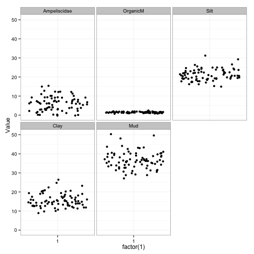

## Basic Exploratory Analysis


```r
#To see what is in the object Benthos, type:
names(Benthos)
```

```
## [1] "Period"       "Fishing"      "OrganicM"     "Mud"         
## [5] "Silt"         "Clay"         "Ampeliscidae" "Cirratulidae"
```

```r
str(Benthos)
```

```
## 'data.frame':	80 obs. of  8 variables:
##  $ Period      : int  1 1 1 1 1 1 1 1 1 1 ...
##  $ Fishing     : Factor w/ 2 levels "no","yes": 1 1 1 1 1 2 2 2 2 2 ...
##  $ OrganicM    : num  1.16 1.38 1.84 1.62 1.62 2.13 1.78 1.87 1.56 1.15 ...
##  $ Mud         : num  35.3 34.5 38.4 30.7 32.6 ...
##  $ Silt        : num  25.1 21.9 23.5 17.7 23.3 ...
##  $ Clay        : num  10.16 12.52 14.94 12.99 9.27 ...
##  $ Ampeliscidae: int  7 4 7 3 4 2 2 0 2 3 ...
##  $ Cirratulidae: int  29 52 68 43 41 22 11 7 5 4 ...
```

## Aim of the analysis:

To model Ampeliscidae as a function of the covariates:

* Period
* Fishing
* OrganicM
* Mud
* Silt
* Clay
with interaction between Fishing and OrganicM.

| Variable | Definition            |
| ---      | ---                   |
| Fishing  | Fishing vs no fishing |
| Period   | Three time periods    |


```r
#Converting Period and Fishing into factors
Benthos$fPeriod <- factor(Benthos$Period)
Benthos$fFishing <- factor(Benthos$Fishing,
                           levels = c("no", "yes"),
                           labels = c("No Fishing", "Fishing"))
```

## BASIC DATA EXPLORATION:
1. Outliers: Y and X
2. Collinearity X
3. Relationships  Y vs X    but also interactions
4. Zero inflation: Make a frequency plot


### 1. Are there any outliers?
  * Outliers in the response variable?
  * #Outliers in the explanatory variables?


```r
Benthos                                         %>%
    select(Ampeliscidae, OrganicM, Silt, Clay, Mud) %>%
    gather(Var, Value)                              %>%
    ggplot()                           +
        geom_jitter(aes(factor(1), Value)) +
        facet_wrap(~Var)
```

 

Great because response var ranges till 15 (<20-25), Poisson may be good.

#Numer of zeros in the response variable


```r
xtable(table(Benthos$Ampeliscidae))
```

% latex table generated in R 3.1.1 by xtable 1.7-4 package
% Tue May  5 01:02:11 2015
\begin{table}[ht]
\centering
\begin{tabular}{rr}
  \hline
 & V1 \\ 
  \hline
0 &   8 \\ 
  1 &   2 \\ 
  2 &   5 \\ 
  3 &  10 \\ 
  4 &   8 \\ 
  5 &   2 \\ 
  6 &  10 \\ 
  7 &  11 \\ 
  8 &   4 \\ 
  9 &   8 \\ 
  10 &   3 \\ 
  11 &   2 \\ 
  12 &   4 \\ 
  13 &   1 \\ 
  15 &   2 \\ 
   \hline
\end{tabular}
\end{table}


```
## stat_bin: binwidth defaulted to range/30. Use 'binwidth = x' to adjust this.
```

 

Calculate percentage  of zeros in data

```r
100 * sum(Benthos$Ampeliscidae == 0) / nrow(Benthos)
```

```
## [1] 10
```

```r
#Not a problem
#???? Why is it not a problem
```

### What about categorical covariates?
Do we have a reasonable number of observations per level of a categorical covariate?


```r
with(Benthos, table(fFishing)) #with the object "Benthos", give me a table
```

```
## fFishing
## No Fishing    Fishing 
##         40         40
```


```r
with(Benthos, table(fPeriod))
```

```
## fPeriod
##  1  2  3 
## 20 30 30
```


```r
with(Benthos, table(fPeriod,fFishing)) #if I was interested in their interaction
```

```
##        fFishing
## fPeriod No Fishing Fishing
##       1         10      10
##       2         15      15
##       3         15      15
```

```r
#Nice, more or less balanced design
```


### 2. Collinearity


```r
pairs(Benthos[, c("OrganicM", "Mud", "Silt", "Clay")])
```

 


```r
#gives you a correlation matrix
cor(Benthos[, c("OrganicM", "Mud", "Silt", "Clay")]) %>% stargazer(type='html')
```

```
## 
## <table style="text-align:center"><tr><td colspan="5" style="border-bottom: 1px solid black"></td></tr><tr><td style="text-align:left"></td><td>OrganicM</td><td>Mud</td><td>Silt</td><td>Clay</td></tr>
## <tr><td colspan="5" style="border-bottom: 1px solid black"></td></tr><tr><td style="text-align:left">OrganicM</td><td>1</td><td>0.061</td><td>0.027</td><td>0.058</td></tr>
## <tr><td style="text-align:left">Mud</td><td>0.061</td><td>1</td><td>0.658</td><td>0.755</td></tr>
## <tr><td style="text-align:left">Silt</td><td>0.027</td><td>0.658</td><td>1</td><td>0.002</td></tr>
## <tr><td style="text-align:left">Clay</td><td>0.058</td><td>0.755</td><td>0.002</td><td>1</td></tr>
## <tr><td colspan="5" style="border-bottom: 1px solid black"></td></tr></table>
```

Too much collinearity!


```r
df = Benthos                                         %>%
    select(Ampeliscidae, OrganicM, Silt, Clay, Mud, fPeriod, fFishing) %>%
    gather(Var, Value, -fFishing, -fPeriod)                             
```


```r
df %>% ggplot()                           +
    geom_boxplot(aes(x=fPeriod, y=Value)) +
    facet_wrap(~Var, scales="free")+ggtitle("Period")
```

 


```r
df %>% 
    ggplot()                           +
    geom_boxplot(aes(x=fFishing, y=Value)) +
    facet_wrap(~Var, scales="free")+ggtitle("Fishing")
```

 


```r
pPeriod = df %>% filter(Var == 'Silt') %>%
    ggplot()                           +
    geom_boxplot(aes(x=fPeriod, y=Value))

pFishing = df %>% filter(Var == 'Silt') %>%
    ggplot()                           +
    geom_boxplot(aes(x=fFishing, y=Value))
grid.arrange(pPeriod, pFishing, nrow=1, main="Silt")
```

 


```r
pPeriod = df %>% filter(Var == 'Clay') %>%
    ggplot()                           +
    geom_boxplot(aes(x=fPeriod, y=Value))

pFishing = df %>% filter(Var == 'Clay') %>%
    ggplot()                           +
    geom_boxplot(aes(x=fFishing, y=Value))
grid.arrange(pPeriod, pFishing, nrow=1, main="Clay")
```

 

Either use mud  or   silt and clay.
Fishing seems to be collinear with some of these.
If you use  mud or clay you cannot use fishing as it is collinear!

### Interactions?

Based on biology we would expect that Ampeliscidae vs O_Material,
changes depending on the dredging effect (CT)!!!


```r
qplot(OrganicM, Ampeliscidae, data=Benthos) + facet_wrap(~fFishing) + 
  stat_smooth(method = "lm", formula = y ~ x, na.rm=T)
```

 
#There is indication for interaction!!

## Start analysis

```r
#Fit the model E(Ampeliscidae ) = mu = exp(alpha + A + B + A:B + C )
M1 <- glm(Ampeliscidae ~ OrganicM * fFishing + fPeriod, 
          data = Benthos,
          family = poisson)
         
#Exactly the same model
M1 <- glm(Ampeliscidae ~ OrganicM + fFishing + 
                         OrganicM : fFishing + 
                         fPeriod, 
          data = Benthos,
          family = poisson)
```
```
#What is the model that we are fitting?
#Ampeliscidae_i ~ P(mu_i)
#E(Ampeliscidae_i) = mu_i   
#and   var(Ampeliscidae_i) = mu_i
#
#log(mu_i) = alpha + OrganicM_i + fFishing_i + 
#            Period_i + OrganicM_i x fFishing_i
```
Check for overdispersion

```
`#Pearson residuals:
#  (Y - E(y))          (Y - mu)
# --------------  = -----------------
#  sqrt(var(Y))         sqrt(mu)
#mu = exp(blah blah blah)
```

### Is the model overdispersed?

```r
E1 <- resid(M1, type = "pearson")
N  <- nrow(Benthos)
p  <- length(coef(M1))
sum(E1^2) / (N - p)
```

```
## [1] 1.422794
```


```r
stargazer(M1, type='html')
```


<table style="text-align:center"><tr><td colspan="2" style="border-bottom: 1px solid black"></td></tr><tr><td style="text-align:left"></td><td><em>Dependent variable:</em></td></tr>
<tr><td></td><td colspan="1" style="border-bottom: 1px solid black"></td></tr>
<tr><td style="text-align:left"></td><td>Ampeliscidae</td></tr>
<tr><td colspan="2" style="border-bottom: 1px solid black"></td></tr><tr><td style="text-align:left">OrganicM</td><td>0.658<sup>**</sup></td></tr>
<tr><td style="text-align:left"></td><td>(0.323)</td></tr>
<tr><td style="text-align:left"></td><td></td></tr>
<tr><td style="text-align:left">fFishingFishing</td><td>1.369<sup>**</sup></td></tr>
<tr><td style="text-align:left"></td><td>(0.656)</td></tr>
<tr><td style="text-align:left"></td><td></td></tr>
<tr><td style="text-align:left">fPeriod2</td><td>1.192<sup>***</sup></td></tr>
<tr><td style="text-align:left"></td><td>(0.179)</td></tr>
<tr><td style="text-align:left"></td><td></td></tr>
<tr><td style="text-align:left">fPeriod3</td><td>1.437<sup>***</sup></td></tr>
<tr><td style="text-align:left"></td><td>(0.176)</td></tr>
<tr><td style="text-align:left"></td><td></td></tr>
<tr><td style="text-align:left">OrganicM:fFishingFishing</td><td>-1.131<sup>**</sup></td></tr>
<tr><td style="text-align:left"></td><td>(0.449)</td></tr>
<tr><td style="text-align:left"></td><td></td></tr>
<tr><td style="text-align:left">Constant</td><td>-0.177</td></tr>
<tr><td style="text-align:left"></td><td>(0.506)</td></tr>
<tr><td style="text-align:left"></td><td></td></tr>
<tr><td colspan="2" style="border-bottom: 1px solid black"></td></tr><tr><td style="text-align:left">Observations</td><td>80</td></tr>
<tr><td style="text-align:left">Log Likelihood</td><td>-184.027</td></tr>
<tr><td style="text-align:left">Akaike Inf. Crit.</td><td>380.054</td></tr>
<tr><td colspan="2" style="border-bottom: 1px solid black"></td></tr><tr><td style="text-align:left"><em>Note:</em></td><td style="text-align:right"><sup>*</sup>p<0.1; <sup>**</sup>p<0.05; <sup>***</sup>p<0.01</td></tr>
</table>


```r
drop1(M1, test = "Chi") %>% stargazer(type='html')
```


<table style="text-align:center"><tr><td colspan="6" style="border-bottom: 1px solid black"></td></tr><tr><td style="text-align:left">Statistic</td><td>N</td><td>Mean</td><td>St. Dev.</td><td>Min</td><td>Max</td></tr>
<tr><td colspan="6" style="border-bottom: 1px solid black"></td></tr><tr><td style="text-align:left">Df</td><td>2</td><td>1.500</td><td>0.707</td><td>1</td><td>2</td></tr>
<tr><td style="text-align:left">Deviance</td><td>3</td><td>142.526</td><td>51.804</td><td>109.491</td><td>202.231</td></tr>
<tr><td style="text-align:left">AIC</td><td>3</td><td>411.089</td><td>50.022</td><td>380.054</td><td>468.794</td></tr>
<tr><td style="text-align:left">LRT</td><td>2</td><td>49.552</td><td>61.077</td><td>6.364</td><td>92.740</td></tr>
<tr><td style="text-align:left">Pr(> Chi)</td><td>2</td><td>0.006</td><td>0.008</td><td>0.000</td><td>0.012</td></tr>
<tr><td colspan="6" style="border-bottom: 1px solid black"></td></tr></table>

Just ok!

Instead of pvalue you have (LRT) **Likelihood Ratio Test**

```
#Suppose that the interaction is not significant:
#Mtest <- glm(Ampeliscidae ~ OrganicM + fFishing  + fPeriod, 
#          data = Benthos,
#          family = poisson)
#summary(Mtest)
#drop1(Mtest, test =  "Chi")
```

### Model validation
Plot residuals vs fitted values
#Influential observations
Plot residuals vs each covariate (in the model, and not in the model)


```r
F1 <- fitted(M1) #command fitted gives already e^model
E1 <- resid(M1, type = "pearson")
plot(x = F1, 
     y = E1,
     xlab = "Fitted values",
     ylab = "Pearson residuals")
abline(h = 0, lty = 2)
```

 

```r
#Cook's distance: influential obs
#There's a paper in the email which you can use (not usable with random effects)
par(mfrow = c(1, 1))
plot(M1, which = 4)
```

 

```r
#Plot Pearson residuals versus each covariate
plot(x = Benthos$OrganicM, 
     y = E1)
abline(h = 0, lty = 2)
```

 

```r
#do the same for other covariates not in model 
plot(x = Benthos$Clay, 
     y = E1)
abline(h = 0, lty = 2)
```

 

```r
plot(x = Benthos$Mud, 
     y = E1)
abline(h = 0, lty = 2)
```

 

```r
plot(x = Benthos$Silt, 
     y = E1)
abline(h = 0, lty = 2)
```

 

```r
boxplot(E1 ~ fPeriod, data = Benthos) 
```

 

```r
boxplot(E1 ~ fFishing, data = Benthos) 
```

 

```r
#Looks all ok
```

### Model interpretation


```r
#Sketch fitted values  for the GLM Poisson model
M1 <- glm(Ampeliscidae ~ OrganicM * fFishing + fPeriod, 
          data = Benthos,
          family = poisson)
```

<table style="text-align:center"><tr><td colspan="2" style="border-bottom: 1px solid black"></td></tr><tr><td style="text-align:left"></td><td><em>Dependent variable:</em></td></tr>
<tr><td></td><td colspan="1" style="border-bottom: 1px solid black"></td></tr>
<tr><td style="text-align:left"></td><td>Ampeliscidae</td></tr>
<tr><td colspan="2" style="border-bottom: 1px solid black"></td></tr><tr><td style="text-align:left">OrganicM</td><td>0.658<sup>**</sup></td></tr>
<tr><td style="text-align:left"></td><td>(0.323)</td></tr>
<tr><td style="text-align:left"></td><td></td></tr>
<tr><td style="text-align:left">fFishingFishing</td><td>1.369<sup>**</sup></td></tr>
<tr><td style="text-align:left"></td><td>(0.656)</td></tr>
<tr><td style="text-align:left"></td><td></td></tr>
<tr><td style="text-align:left">fPeriod2</td><td>1.192<sup>***</sup></td></tr>
<tr><td style="text-align:left"></td><td>(0.179)</td></tr>
<tr><td style="text-align:left"></td><td></td></tr>
<tr><td style="text-align:left">fPeriod3</td><td>1.437<sup>***</sup></td></tr>
<tr><td style="text-align:left"></td><td>(0.176)</td></tr>
<tr><td style="text-align:left"></td><td></td></tr>
<tr><td style="text-align:left">OrganicM:fFishingFishing</td><td>-1.131<sup>**</sup></td></tr>
<tr><td style="text-align:left"></td><td>(0.449)</td></tr>
<tr><td style="text-align:left"></td><td></td></tr>
<tr><td style="text-align:left">Constant</td><td>-0.177</td></tr>
<tr><td style="text-align:left"></td><td>(0.506)</td></tr>
<tr><td style="text-align:left"></td><td></td></tr>
<tr><td colspan="2" style="border-bottom: 1px solid black"></td></tr><tr><td style="text-align:left">Observations</td><td>80</td></tr>
<tr><td style="text-align:left">Log Likelihood</td><td>-184.027</td></tr>
<tr><td style="text-align:left">Akaike Inf. Crit.</td><td>380.054</td></tr>
<tr><td colspan="2" style="border-bottom: 1px solid black"></td></tr><tr><td style="text-align:left"><em>Note:</em></td><td style="text-align:right"><sup>*</sup>p<0.1; <sup>**</sup>p<0.05; <sup>***</sup>p<0.01</td></tr>
</table>

### A. What is the model that we are fitting?

```
Ampeliscidae_i ~ Poisson(mu_i)
E(Ampeliscidae_i)   = mu_i
var(Ampeliscidae_i) = mu_i
         alpha + OrganicM + Fishing + Period + OrganicM:Fishing  
mu_i = e
```

#### B. What are the equations for each period/Fishing combination?
```
###### What is the equation for Period = 1 & Fishing = Non Fishing
         -0.1766 + 0.657 * OrganicM_i  
mu_i = e
```

##### What is the equation for Period = 2 & CT = Non-Fishing
```
         -0.1766 +  1.1919 + 0.657 * OrganicM_i  
mu_i = e
```


##### What is the equation for Period = 3 & CT = Non-Fishing
```
         -0.1766 +  1.4371 + 0.657 * OrganicM_i  
mu_i = e
```

##### What is the equation for Period = 1 & CT = Fishing
```
         -0.1766 + 1.3694 + (0.657 -1.1314) * OrganicM_i  
mu_i = e
```


##### What is the equation for Period = 2 & CT = Fishing
```
-0.1766 + 1.3694 + 1.19 + (0.657 -1.1314) * OrganicM_i  
#mu_i = e
```


```r
#Sketch them in a graph
# range(Benthos$OrganicM)
myData = Benthos %>% select(fPeriod, fFishing) %>% unique %$%
do.call(rbind,mapply(
    function(fFishing,fPeriod){
          data.frame(
              OrganicM = with(Benthos, seq(min(OrganicM),max(OrganicM),len=10)),
              fPeriod,
              fFishing
          )
    },
    fFishing = fFishing,
    fPeriod  = fPeriod,
    SIMPLIFY = FALSE))

myData %<>%
    group_by(fPeriod, fFishing) %>%
    do({
       data.frame(.,Ampeliscidae= predict(M1, newdata= ., type="response", se=TRUE))    #whats the difference between type=link
    })

p0 = ggplot(Benthos)+
        geom_point(aes(OrganicM, Ampeliscidae, color = factor(fFishing))) +
        labs(y = "Ampeliscidae",x = "Organic Matter")+scale_color_discrete("Fishing")

p1 = p0 +
geom_smooth(data = myData, 
            aes(y=Ampeliscidae.fit, x=OrganicM, 
                ymin = Ampeliscidae.fit-Ampeliscidae.se.fit, ymax = Ampeliscidae.fit+Ampeliscidae.se.fit,
                color=fFishing,
                linetype=fPeriod
                ), stat = "identity")
```

Cirratulidae (Second Species)
====

Similar data exploration steps


#Sketch model fit
MyData <- expand.grid(fPeriod = levels(Benthos$fPeriod),
                      fFishing = levels(Benthos$fFishing))
MyData

P <- predict(M4, newdata = MyData,
                    type = "link", se = TRUE)

MyData$Fit   <- exp(P$fit) #need to do exponential
MyData$SeUp  <- exp(P$fit + 2 * P$se.fit)
MyData$SeLow <- exp(P$fit - 2 * P$se.fit)
```
